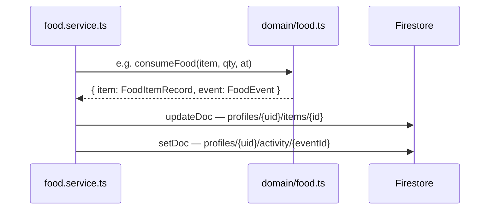
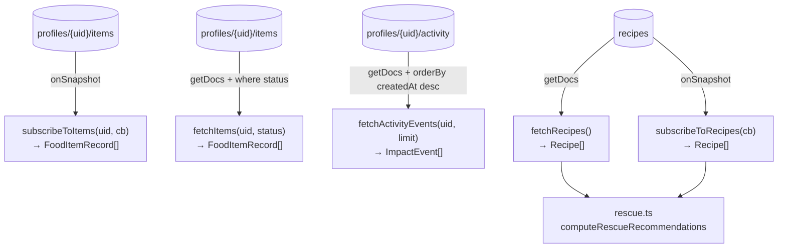

# FreshVII — Backend Service & Data Flow

---

## Service + Domain Overview

```mermaid
flowchart LR
  subgraph Service["firebase/services/"]
    FS["food.service.ts\naddItem · markOpened · moveToFreezer\nunfreezeItem · consumeItem · discardItem\ncreateLeftoverItem · subscribeToItems\nfetchItems · fetchActivityEvents"]
    AS["auth.service.ts\nregister · login · logout"]
    RS["recipe.service.ts\nfetchRecipes · subscribeToRecipes"]
  end

  subgraph Domain["domain/"]
    FD["food.ts\ncreateFoodItem · openFood · freezeFood\nunfreezeFood · consumeFood · discardFood\ncreateLeftover"]
    FR["freshness.ts\nestimateExpiry · calculateFreshness\ncalculateRescueScore"]
    RD["rescue.ts\nmatchRecipes · rankRescueResults\ncomputeRescueRecommendations"]
    IM["impact.ts\ncomputeImpactMetrics"]
  end

  subgraph Firestore["Firestore"]
    Items[("profiles/{uid}/items")]
    Activity[("profiles/{uid}/activity")]
    Recipes[("recipes")]
    Users[("users/{uid}")]
    FoodCats[("food_categories")]
  end

  FS -->|calls| FD
  FS -->|reads/writes| Items
  FS -->|writes| Activity
  Activity -->|read by| FS
  Items -->|read by| FS

  RS -->|reads| Recipes
  RS -->|feeds| RD

  AS -->|writes| Users

  FD -->|uses| FR
  RD -->|uses| FR
  IM -.->|accepts FoodEvent[]| FD
```

---

## Write Flow — lifecycle action → Firestore

Every write goes: **service** calls **domain** (pure logic) → gets back `{ item, event }` → writes both to Firestore.



| Service function | Domain call | Firestore writes |
|---|---|---|
| `addItem` | `createFoodItem` | `setDoc` items + `setDoc` activity |
| `markOpened` | `openFood` | `updateDoc` items + `setDoc` activity |
| `moveToFreezer` | `freezeFood` | `updateDoc` items + `setDoc` activity |
| `unfreezeItem` | `unfreezeFood` | `updateDoc` items + `setDoc` activity |
| `consumeItem` | `consumeFood` | `updateDoc` items + `setDoc` activity |
| `discardItem` | `discardFood` | `updateDoc` items + `setDoc` activity |
| `createLeftoverItem` | `createLeftover` | `writeBatch` → 2× items + 2× activity |

---

## Read Flow — Firestore → service → caller



---

## Data Structures

### `FoodItemRecord` — `profiles/{uid}/items/{id}`

| Field | Type | Notes |
|---|---|---|
| `id` | `string` | UUID |
| `name` | `string` | |
| `category` | `FoodCategory` | `'Produce' \| 'Dairy & eggs' \| 'Meat' \| 'Grains' \| 'Pantry'` |
| `subcategory_id` | `string?` | ref to `food_categories` |
| `quantity` | `number` | |
| `unit` | `MeasurementUnit` | `'g' \| 'ml' \| 'pcs' \| …` |
| `storageLocation` | `StorageLocation` | `'fridge' \| 'freezer' \| 'pantry'` |
| `opened` | `boolean` | |
| `dateAdded` | `string` | ISO |
| `openedDate` | `string?` | ISO, set by `openFood` |
| `frozenDate` | `string?` | ISO, set by `freezeFood` |
| `estimatedExpiry` | `string?` | ISO, computed by `estimateExpiry()` |
| `status` | `FoodStatus` | `'active' \| 'consumed' \| 'discarded'` |
| `createdAt` | `string` | server timestamp → ISO |
| `updatedAt` | `string` | server timestamp → ISO |
| `archivedAt` | `string?` | set on consumed / discarded |

### `FoodEvent` — `profiles/{uid}/activity/{id}`

| Field | Type | Notes |
|---|---|---|
| `id` | `string` | `{itemId}-{type}-{timestamp}` |
| `foodItemId` | `string` | ref to item |
| `type` | `FoodEventType` | `added \| opened \| frozen \| unfrozen \| consumed \| discarded \| edited \| leftover-created` |
| `quantityBefore` | `number?` | |
| `quantityChange` | `number?` | negative on consume/discard |
| `quantityAfter` | `number?` | |
| `metadata` | `Record<string, string\|number\|boolean>?` | extra context per event |
| `createdAt` | `string` | ISO |

### `FoodEventType` → `ImpactEvent.type` mapping

| `FoodEventType` (Firestore) | `ImpactEvent.type` (service output) |
|---|---|
| `added` | `product-added` |
| `consumed` | `food-consumed` |
| `frozen` | `moved-to-freezer` |
| `opened` | `food-opened` |
| `unfrozen` | `food-frozen-unfrozen` |
| `discarded` | `food-discarded` |
| `leftover-created` | `leftover-created` |
| `edited` | `food-edited` |

### `ImpactEvent` — output of `fetchActivityEvents`

| Field | Type | Notes |
|---|---|---|
| `id` | `string` | |
| `foodItemId` | `string` | |
| `type` | `string` | mapped type (above) |
| `label` | `string?` | human-readable |
| `quantityBefore` | `number?` | |
| `quantityChange` | `number?` | |
| `quantityAfter` | `number?` | |
| `metadata` | `Record<string, …>?` | |
| `createdAt` | `string` | ISO |

### `ImpactMetrics` — output of `computeImpactMetrics(events: FoodEvent[])`

| Field | How computed |
|---|---|
| `ingredientsRescued` | count of `consumed` events |
| `mealsCooked` | count of `leftover-created` events |
| `estimatedFoodSaved` | `sum(Math.abs(quantityChange))` from `consumed` events |
